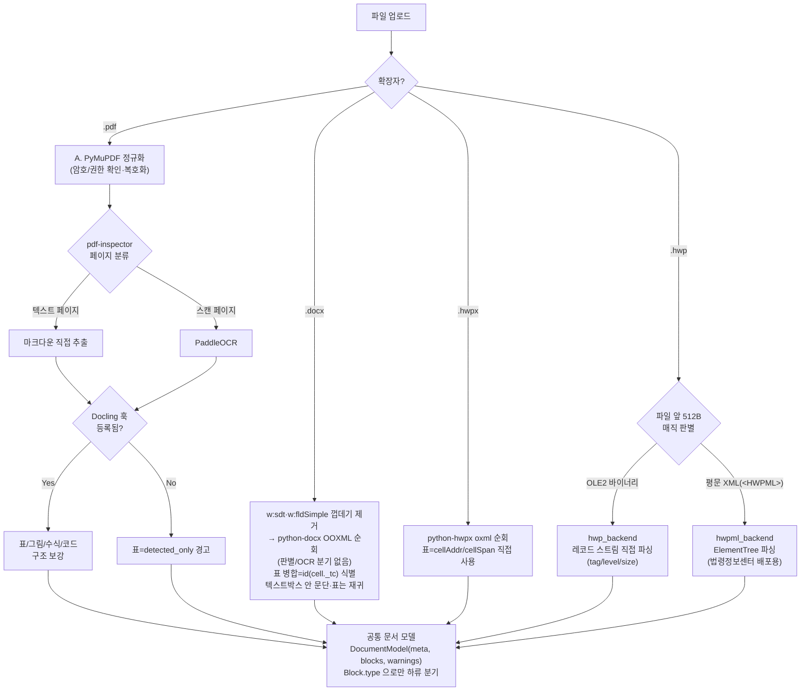

# doc_parser

> **이 모듈에는 현재 파이프라인 두 갈래가 공존한다.**
> 서로 다른 브랜치에서 각자 자라난 것으로, 아직 통합되지 않았다.
>
> | | 진입점 | 반환 | 위치 |
> |---|---|---|---|
> | **A. 수집 파이프라인** | `load_document` → `normalize` → `chunk` | `RawDoc` / `Document` | 패키지 `__init__.py`, `ingestion/` `normalize/` `fields/` |
> | **B. 백엔드 라우터** | `router.parse_document` | `DocumentModel` | `router.py`, `*_backend.py` |
>
> 패키지 `__init__.py` 가 공개하는 것은 **A** 뿐이다. **B** 는
> `from modules.doc_parser.router import parse_document` 처럼 서브모듈 경로로 가져온다.
> 아래 두 절이 각각을 설명한다.

---

## A. 수집 파이프라인 (`load_document` → `normalize` → `chunk`)

PDF·Word·HWP를 공통 문서 모델(장절·표·위치)로 변환. load_document→normalize→chunk, to_pdf 변환.

## 공개 인터페이스
`__init__.py`에서 export하는 것만 외부에서 쓴다:

`load_document` `normalize` `chunk` `to_pdf` `build_html` `ConvertUnavailable` · 로더 `PdfDigitalLoader` `DocxLoader` `HwpxLoader` `HwpLoader` `TextLoader` `PdfOcrLoader` · `RawDoc` `UnsupportedFormatError` `PAGE_BREAK`.

필드 추출: `FieldSpec` `FieldValue` `TableRow` `extract_fields`.

## 추출 어휘 (`FieldSpec.source`)

| `from` | 무엇을 꺼내나 | 어떻게 찾나 |
|---|---|---|
| `table` (기본) | 칸 **하나** | `labels` 후보 중 셀 전체가 같은 것 → `at: right\|below` 칸 |
| `table_rows` | 표의 **모든 행** | `columns` 조합이 다 있는 줄이 머리행, 그 아래가 데이터 |
| `checkbox_group` | 선택된 것들 | `options` 와 체크 기호 |
| `header` · `footer` | — | **아직 못 읽는다.** 서식 레이어가 없어 `found=False` 로 돌려준다 |

`table` 값 칸 하나에 여러 하위 값이 섞여 있으면 `capture` 정규식으로 필요한 값만
꺼낸다. `(?P<value>...)` 그룹이 있으면 그 그룹을 필드 값으로 사용한다.

```yaml
- name: 시험환경_온도
  from: table
  labels: [시험 환경]
  at: right
  capture: '온도\s*:\s*(?P<value>\([^)]*\)\s*°C)'
```

`table_rows` 는 값이 칸 하나가 아니라 표 전체인 항목을 위한 것이다 —
EV2 개정기록 완전성·평가표 완전성, AI시험인증1 제출물 목록·시험절차.

```yaml
- name: 개정기록
  from: table_rows
  columns: [개정번호, 일시, 해당 절, 개정 사유, 담당자, 승인자]
  key: 개정번호            # 이 열이 비면 빈 양식 행 (생략하면 첫 열)
  required_columns: [...]  # 검사기가 읽는다 — 이 열이 빈 행은 지적감
```

실문서가 강요한 규칙 셋:

- **열 조합으로 표를 특정한다.** "담당자" 하나로는 어느 표인지 모른다. 하나라도
  없으면 `found=False` — 일부만 맞는 표를 검사하면 거짓 지적이 난다.
- **key 열이 빈 행은 뺀다.** 제출물 확인증은 실제 1건에 빈 양식 행이 20줄 더 있다.
- **머리행보다 칸이 적은 줄은 뺀다.** 표 끝에 `| 비고 |  |` 가 붙는데, 그냥 두면
  "비고"가 제출물명이 된다. 쪽을 넘겨 되풀이된 머리행도 건너뛴다.

열 사이에 빈 칸이 끼어 있어도(EV2 개정기록은 `| 개정번호 |  | 일시 |  | …`)
이름으로 맞추므로 상관없다.

## 입출력 스키마
검사 Agent는 공통 Finding 스키마로 반환한다(루트 CLAUDE.md 참조). Finding·Document 등 공통 타입은 `modules.shared`.

## docx → PDF 변환 (뷰어용)

`convert.to_pdf` 가 LibreOffice(`soffice`)로 굽는다. 검사 파이프라인은 이걸 안 쓴다 —
검사는 원본을 직접 읽는다. 이건 **화면에 보여줄 PDF** 를 만드는 길이다.

굽기 전에 `ptab.rewrite_ptabs` 가 머릿말·꼬리말의 `w:ptab`(Word 절대위치 탭)을
LibreOffice 가 읽는 탭으로 바꾼다. **LibreOffice 는 `w:ptab` 을 통째로 무시해서**
`의뢰번호 …[오른쪽 끝]… 성적서번호` 가 붙어 나온다. 실측(사내 docx 24개 중 16개가
해당, 절대탭 82개):

    성적서번호 끝 위치   원본 지시 567pt · 손대기 전 314pt · 지금 567pt

원본 파일은 안 건드린다(임시 사본에서 고친다). 자세한 근거는 `ptab.py` 머리말.

**남은 차이**: 서버에 문서가 쓰는 한글 글꼴이 없으면 LibreOffice 가 치환해 글자폭이
달라진다(실측: 사내 문서가 쓰는 글꼴 9종 중 서버 보유 0종). 이건 글꼴 설치로만
없어진다 — 변환 코드로는 못 고친다.

## 의존성
- 외부 패키지: pdfplumber, pypdf, rhwp-python(구형 .hwp 파싱).
- 시스템: 뷰어용 PDF 변환(`convert.to_pdf`)에 LibreOffice(soffice)+H2Orestart 확장.
  파싱에는 필요 없다 — 파싱과 뷰잉은 별개 경로다.
- 모듈 의존: `shared`(Document·Section·Chunk 등).

rhwp-python 0.8.1 linux 휠은 낡은 freetype을 번들해 `import rhwp`가 깨진다.
`uv sync` 뒤 `./scripts/fix-rhwp-freetype.sh` 를 한 번 돌린다(상류가 고치면 삭제).

## 형식별 경로
| 입력 | 파싱 | 쓰는 것 | 뷰어용 PDF |
|------|------|---------|-----------|
| `.pdf` 디지털 | `PdfDigitalLoader` | **pdfplumber**(본문·글자 좌표·표 bbox) + **pypdf**(책갈피·암호 판정) | 원본 그대로 |
| `.pdf` 스캔 | `PdfOcrLoader` | **엔진 미구현** — `ingestion/ocr/base.py` 에 인터페이스만 | 원본 그대로 |
| `.hwpx` | `HwpxLoader` | 표준 라이브러리 (ZIP+OWPML XML) | soffice + H2Orestart |
| `.hwp` | rhwp → hwpx → `HwpxLoader` | **rhwp-python** (Rust 파서 PyO3 바인딩) | soffice + H2Orestart |
| `.docx` | `DocxLoader` | 표준 라이브러리 (ZIP+OOXML XML) | soffice |

`pypdf` 의 `extract_text()` 는 셀 안에 줄바꿈이 있는 표에서 한 행을 3~5줄로
파열시킨다(`ingestion/pdf_tables.py` 첫 주석에 실측 예시). 이 문서들은 표 안 글자가
54~88% 라 본문은 `pdfplumber` 로 읽는다. 다만 책갈피(outline) API 가 `pdfplumber` 에
없어서 그것만 `pypdf` 로 읽는다 — 둘 다 쓰는 이유가 이것이다.

## 그림

그림 안의 내용은 **아직 읽지 못한다**(비전 모델이 할 일). 다만 있었다는 사실은
남긴다 — 흔적조차 없으면 "그림으로 설명한" 문서를 "설명이 없다"고 읽게 된다.

본문에 자리표시가 들어가고, `meta["images"]` 가 같은 번호로 이어진다:

```
본문   [그림 3: 텍스트, 스크린샷이(가) 표시된 사진]
meta   {"no": 3, "name": "그림 12", "alt": "텍스트, 스크린샷…",
        "part": "word/media/image2.png"}
```

- `part` 는 **ZIP 내부 경로**다. 바이트는 담지 않는다 — RawDoc 은 JSON 직렬화
  가능해야 한다(저장·재검증·Lv3 문서 DB 대비). 그림이 필요한 쪽이 `source_path`
  로 ZIP 을 다시 열면 된다.
- `.hwp` 는 예외다. `part` 가 변환된 임시 hwpx 기준이라 그 파일이 이미 지워져
  있다. `to_hwpx_bytes()` 를 다시 부르면 된다(같은 입력에 같은 결과, 0.1초).
- **대체텍스트는 워드만 준다.** 한컴은 넣지 않아 hwpx·hwp 는 번호만 남는다.
- 이미지가 없는 도형(`직사각형 10` 같은 것)은 세지 않는다. 도형 안의 글자는 이미
  본문으로 읽으므로 또 세면 개수만 부푼다 — 실문서에서 11개 중 5개가 그랬다.
- **크기(`width`·`height`)를 함께 기록한다.** 뷰어용 PDF 안의 이미지와 짝짓는
  열쇠다 — LibreOffice 가 도형을 이미지로 렌더해 개수가 어긋나는 문서가 있어
  (실측: 파싱 6장 vs PDF 7장) 순서만으로는 못 짝짓는다. 짝짓기는 report 모듈의
  `match_images` 가 한다.
- PDF 는 아직 그림을 걷지 않는다.

---

## B. 백엔드 라우터 (`router.parse_document`)

PDF·Word·HWP를 공통 문서 모델(장절·표·그림·위치)로 변환한다. 하류(下流) 소비자는
`Block.type`으로만 분기한다 — 어느 경로(pdf-inspector 직접추출/PaddleOCR/Docling/Qwen3-VL)로
왔는지는 몰라도 된다.

## 지원 형식

| 형식 | 상태 | 백엔드 |
|---|---|---|
| PDF | ✅ 구현 | `pdf_backend.py` |
| DOCX | ✅ 구현 + 실 샘플 10건 커버리지 검증 | `docx_backend.py` (실제 시험성적서/의뢰서 계열 10건을 원본 OOXML 의 모든 `w:t` 와 대조해 유실 문단을 찾는 방식으로 검증 — 내용 컨트롤(`w:sdt`)로 감싼 셀·run 이 통째로 유실되던 버그(의뢰기관명·담당자·연락처·의뢰번호 등 핵심 입력값 23건), 필드(`w:fldSimple`) 결과 유실, 텍스트박스(`w:txbxContent`) 안 문단·표 미수집을 발견·수정) |
| HWPX | ✅ 구현 + 실 샘플 3건 rhwp 교차검증 | `hwpx_backend.py` (python-hwpx 기반, 각주/미주·수식·다단·도형 텍스트 포함. 실제 법률/조례 `.hwpx` 3건을 [rhwp](https://github.com/edwardkim/rhwp) 와 차등 비교 — 한컴 오피스가 머리말/꼬리말을 섹션 속성이 아니라 문단 흐름 중 인라인 컨트롤(`hp:ctrl>hp:header|footer`)로 내보내는 경우 표가 통째로 유실되던 실제 버그 1건 발견·수정(회귀테스트 완비)) |
| HWP(구버전 바이너리, OLE2) | ⚠️ 실 샘플 6건 검증(표/병합/텍스트) + rhwp 교차검증 | `hwp_backend.py` (OLE2 CFB + 레코드 직접 파싱. 표/병합/중첩표·문단 텍스트는 실 파일 검증에 더해, 독립 Rust 구현체 [rhwp](https://github.com/edwardkim/rhwp)(`export-tables`/`export-text --json`)와 차등 비교하는 교차검증(2회, 실 파일 6건 누적)으로 빈 문단 유실·GSO 컨트롤코드 과잉스킵·강제 줄바꿈(Shift+Enter) 무시 등 실제 버그 4건을 추가로 발견·수정(회귀테스트 완비). 이미지·각주/미주·제목·수식·머리말/꼬리말·다단은 구현됐으나 미검증. 암호화·배포용(DRM) 문서는 탐지만 하고 복호화는 미구현(알고리즘 미공개, 검증 샘플 없음)) |
| HWPML(`.hwp` 확장자, 구형 XML) | ⚠️ 실 샘플 1건 검증 | `hwpml_backend.py` (순수 XML, 새 의존성 없음. `.hwp` 라우팅 시 OLE2 여부로 hwp_backend 와 자동 분기. 문단/제목/표/병합/중첩표/이미지/머리말·꼬리말(표 포함)은 법률 문서 1건으로 검증, 각주/미주는 HEADER/FOOTER 와 동일 구조를 가정했을 뿐 미검증, 수식·다단·암호화는 미구현) |

## 파싱 로직 다이어그램 (전체 라우팅)

`parse_document(path, ...)` 하나가 유일한 진입점이며, 확장자로 백엔드를 고른다. `.hwp`는
확장자만으로 실제 포맷(OLE2 바이너리 HWP5 vs 평문 XML HWPML)을 알 수 없어 파일 앞부분을
먼저 봐서 재판별한다(`router.py`). 어느 경로든 결과는 공통 `DocumentModel`로 수렴하고,
하류는 `Block.type`으로만 분기한다(어느 엔진에서 왔는지는 몰라도 됨).



PDF 내부 4단계([A]~[E])의 상세는 바로 아래 "PDF 파이프라인" 절 참조.

## PDF 파이프라인 (확정)

```
PDF 입력
 └ [A] 정규화 prestep(복호화)          PyMuPDF (운영은 pikepdf/qpdf 로 교체 가능)
 └ [B] pdf-inspector: 페이지별 분류 (TextBased/Scanned/Mixed, 신뢰도)
    ├─ 텍스트 페이지 → pdf-inspector 직접 추출 (좌표·글꼴 포함, OCR 안 태움)
    └─ 스캔 페이지  → PaddleOCR (GPU)
 └ [C] Docling: 장절·표(무선/병합/중첩) 구조 + 그림 영역 복원
 └ [D] Qwen3-VL: 그림·다이어그램 의미 해석 필요 시에만 (훅만 존재, 어댑터 미구현)
 └ [E] 공통 문서 모델(DocumentModel)로 정규화
```

- **8/1 게이트**: pdf-inspector 한글(CID 폰트) 추출 품질을 대표 문서로 검증. 실패 시
  `set_text_engine("pymupdf")` — 텍스트 추출만 PyMuPDF로 교체하고 라우팅 구조는 유지한다.
- 책갈피·링크·서명 병합 검사용 저수준 접근은 해당 검사 구현 시점에 보조 라이브러리 합의 추가.

## 공개 인터페이스 (`router.py`에서 export하는 것만 외부 사용)

DocSuree 안에서는 `from modules.doc_parser import router` 로 사용한다.
(패키지 `__init__.py` 는 A 계열 전용이라 이 이름들을 공개하지 않는다.)

```python
from modules.doc_parser import router as dp

doc = dp.parse_document("file.pdf", password="")   # -> DocumentModel (.docx 도 동일 함수)
doc.blocks                                          # list[Block]
doc.tables, doc.figures, doc.text, doc.to_dict()

dp.register_ocr(hook)       # PaddleOCR   hook(img_bytes, page_idx) -> str
dp.register_docling(hook)   # Docling     hook(clean_pdf_path) -> {"tables":[...], "figures":[...]}
dp.set_text_engine("pymupdf")           # 8/1 게이트 결과 반영("pdf-inspector"|"pymupdf")
dp.check_cid_quality([paths]) -> GateResult   # 8/1 게이트 검사
```

실사용 훅 팩토리: `ocr_paddle.make_ocr_lines_hook(lang="korean")`,
`docling_adapter.make_docling_hook()`.

## 입출력 스키마

`DocumentModel` (`model.py`):

| 필드 | 타입 | 설명 |
|---|---|---|
| `source` | `str` | 파일명 |
| `meta` | `dict` | 페이지 수, 암호화/권한, 워터마크 후보 등 |
| `blocks` | `list[Block]` | 본문 |
| `warnings` | `list[str]` | 파싱 중 경고 |

`Block`:

| 필드 | 타입 | 설명 |
|---|---|---|
| `type` | `str` | `HEADING`/`PARAGRAPH`/`TABLE`/`FIGURE`/`FORMULA`/`CODE` — 하류가 분기하는 유일한 키 |
| `page` | `int` | 0-indexed |
| `text` | `str \| None` | |
| `bbox` | `list[float] \| None` | `[x0,y0,x1,y1]` PDF pt |
| `table` | `TableData \| None` | `type == TABLE`일 때 |
| `origin` | `str` | `text`/`ocr`/`docling`/`vlm` — 메타데이터일 뿐, 하류 분기 근거로 쓰면 안 됨 |
| `section` | `str` | `body`/`header`/`footer` — 메타데이터 |
| `needs_semantic` | `bool` | 그림/다이어그램 의미해석(VLM) 대기 표시 |

`TableData`: `rows`/`cols`/`cells`(정규화 격자, 병합 영역은 앵커 셀에만 값) /
`nested`(셀 안에 표 존재) / `detected_only`(Docling 미연결 시 구조 미복원, 검출만) /
`merges`(1x1 초과 병합 영역) / `nested_tables`(실제 중첩 표) /
`images`(셀 안 이미지 `[{"row","col","figure": Block}]` — 표 밖 이미지는 최상위 FIGURE
블록이고, 셀 안 이미지는 어느 셀이었는지를 잃지 않도록 여기 담긴다. PDF·DOCX·HWPX·HWP5
공통 관례).

`doc.to_dict()` / `Block.to_dict()`는 JSON 직렬화 가능한 dict를 반환한다(값이 `None`인
필드는 생략).

## 알려진 이슈

- **pdf-inspector 마크다운 추출 실패를 스캔으로 오인** — 해결됨(실측 2026-08-06,
  `99. 일반성적서 예시.pdf`). `extract_pages_markdown()` 이 10쪽 중 6쪽을 빈 문자열 +
  `needs_ocr=True`(`ocr_reason="suspected_garbled_text"`)로 돌려주는데, 같은 라이브러리의
  `classify_pdf()` 는 `pages_needing_ocr=[]`, `extract_text()` 는 한글 100% 추출이었다 —
  스캔 페이지가 아니라 **추출 API 만의 실패**다. 그대로 믿고 OCR 을 태우면 시간을 쓰고
  원문 대신 오인식 텍스트가 결과에 담긴다. `_md_extract_failed()` 가 **문서 내부 상대
  기준**(마크다운 추출에 성공한 페이지들의 원문 글자 수 중앙값)과 비교해 이 경우를 가려내고,
  해당 페이지만 PyMuPDF 텍스트로 폴백한다(전역 `TEXT_ENGINE` 은 그대로). 어느 페이지가
  그랬는지는 `meta.md_extract_failed_pages` 에 남고, 그 페이지는 스캔이 아니므로
  `meta.scanned_pages` 에서는 빠진다.
- **pdf-inspector 사전정의 CJK CMap 미지원**: 한글 폰트가 사전정의 CMap(`UniKS-UTF16-H`
  등)으로 기록된 PDF에서 `extract_text`가 `ValueError: PDF parsing error: invalid
  character encoding`으로 실패한다(분류/라우팅은 정상). 임베디드 TrueType +
  `Identity-H`(일반적인 한글 PDF)는 정상. 8/1 게이트 실패 시 PyMuPDF 폴백으로 해결.
  동작 범위는 `tests/test_pdf_inspector_encoding.py`에 xfail로 고정.
- **회전 페이지(`/Rotate` 90°)에서 Docling 표 구조가 뒤틀리는 문제** — 해결됨. 원인은
  Docling `pypdfium2_backend.py`의 좌표계 불일치(이미지 bbox는 회전 보정, 텍스트 셀 bbox는
  미보정). 회전 페이지는 Docling 표 대신 pdf-inspector 표를 유지하도록 필터링. 180°/270°는
  미검증(더미 PDF 없음).
- **스캔 페이지 표 구조 소실** — 해결됨(실제 문서 `SST-26-999-C01`로 발견·검증). Docling이
  `do_ocr=False`에서도 스캔 표 셀 텍스트를 상당 부분 자체 인식하므로, Docling이 채운 셀은
  덮지 않고 빈 셀만 PaddleOCR로 채움(`pdf_backend._fill_table_from_ocr`). 겹침 판정은 절대
  마진이 아니라 표/셀 크기 대비 상대 비율(5%)로 설계(문서 1건에 대한 절대값 튜닝은 과적합
  판단으로 배제).
- **수식/코드 블록** — Docling `do_formula_enrichment`/`do_code_enrichment` 배선은
  완료했으나, 더미 테스트셋에서는 레이아웃 모델이 수식을 `Picture`로, 코드를 `TEXT`로
  분류해버려 라벨 자체가 안 붙어 트리거되지 않음. 실제 문서로 Docling 기본 인식률을 먼저
  관찰 후 대안(Pix2Text 등) 필요성 판단 예정 — 미착수.
- **Windows 로캘(cp949) 인코딩 이슈**: Docling 수식/코드 enrichment가 `torch.compile()`
  경로를 타면서 CUDA 커널 템플릿 파일을 `encoding=` 지정 없이 열어 한국어 Windows에서
  `UnicodeDecodeError`로 죽는 PyTorch 쪽 문제 확인됨. `run_poc.py`/`parse_file.py`가 시작
  시 `PYTHONUTF8=1`을 보장하도록 자체 재실행 가드를 넣어 해결.

## 의존성 설치

**쓰는 포맷의 것만 깔면 된다.** 백엔드는 `parse_document()` 가 확장자를 보고 그때 import 하므로,
설치되지 않은 포맷이 있어도 `import doc_parser.router` 자체는 깨지지 않는다. 목록의 단일 출처는
저장소 루트 `pyproject.toml` 의 `[project.optional-dependencies]` 다.

```bash
uv sync --extra doc_parser        # PDF/DOCX/HWPX/HWP5
uv sync --extra doc_parser_ocr    # + 스캔 OCR(PaddleOCR)·구조 복원(Docling)
```

**포맷별 (`--extra doc_parser`)**

| 포맷 | 필요 패키지 | 버전 범위 |
|---|---|---|
| PDF | `pdf-inspector` (페이지 분류·텍스트 추출) | `>=0.2.5,<0.3` |
| PDF | `pymupdf` (fitz — 복호화 prestep·텍스트 엔진 폴백·테스트셋 생성) | `>=1.26,<2` |
| DOCX | `python-docx` | `>=1.1,<2` |
| HWPX | `python-hwpx` (OWPML) | `>=5.1.1,<6` |
| HWP5 | `olefile` (OLE2) | `>=0.47,<1` |
| **HWPML** | **없음 — 표준 라이브러리만** | — |

**선택: 스캔 OCR·구조 복원 (`--extra doc_parser_ocr`)** — 없어도 파싱은 되고, 스캔
페이지 텍스트와 표 구조 품질이 떨어진다.

| 패키지 | 버전 범위 | 용도 |
|---|---|---|
| `paddleocr` | `>=3.7.0,<3.8` | 스캔 페이지·이미지 OCR |
| `paddlepaddle` / `paddlepaddle-gpu` | `>=3.3,<4` | PaddleOCR 연산 백엔드(**둘 중 하나만**) |
| `docling` | `>=2.115.0,<3` | 표/그림/수식/코드 구조 복원 (`torch` 를 끌고 온다) |
| `numpy` | `>=2,<3` | OCR 이미지 배열 |
| `pillow` | `>=11,<13` | 이미지 처리 |

버전 상한은 반드시 건다 — 상한 없이 뒀다가 `python-hwpx` 가 5.1.1 → 5.8.0 으로 올라가며
HWPX 각주 구조가 바뀐 걸 뒤늦게 발견한 이력이 있다(2026-08-06).

안 깔린 포맷을 파싱하려 하면 무엇을 설치해야 하는지 알려주는 `ImportError` 가 난다.
`paddlepaddle-gpu` 는 PyPI 기본 인덱스에 없어 별도 인덱스가 필요하다.

Qwen3-VL(그림·다이어그램 의미 해석)은 어댑터 미구현. 대상 블록은 `needs_semantic=True` 로
표시만 해두며, 훅 등록 함수는 어댑터가 실제로 생길 때 추가한다(쓰는 곳 없는 인터페이스를
미리 두지 않음).

## 실행 디바이스 설정

OCR·구조 복원 모델을 어디에 올릴지는 **이 모듈이 정하지 않고 환경변수로 주입받는다**
(CLAUDE.md "GPU·모델 배치는 배포 설정으로만 결정, 코드에 GPU 번호 하드코딩 금지").

| 환경변수 | 값 | 기본 |
|---|---|---|
| `DOC_PARSER_DEVICE` | `auto` \| `cpu` \| `cuda` \| `cuda:N` \| `mps` \| `xpu` (`gpu` = `cuda` 별칭) | `auto` |

`auto` 면 PaddleOCR·Docling 각자의 자동 감지를 그대로 쓴다. 값을 주면 [`config.py`](config.py)
가 엔진별 표기로 변환해 넘긴다(PaddleOCR 은 `gpu:0`, Docling 은 `cuda:0` 이라고 부른다).
잘못된 값은 조용히 CPU 로 떨어지지 않고 `ValueError` 로 즉시 실패한다 — "GPU 서버에
배포했는데 왜 느리지"를 못 찾는 상황을 막기 위함.

```yaml
# docker-compose.yml — 마이그레이션은 이 값 교체로 끝나야 한다
environment:
  DOC_PARSER_DEVICE: "cuda:0"
```

입출력 경로도 같은 방식이다 — `DOC_PARSER_TESTSET`(입력), `DOC_PARSER_OUT`(출력).
미설정이면 모듈 자기 폴더 기준으로 떨어진다(폴더째 복사해도 동작하도록).

## 모듈만 떼어 쓸 때

내부 import 가 전부 패키지 상대 경로라, 이 폴더를 다른 프로젝트에 통째로 복사해
`doc_parser/` 로 두기만 하면 동작한다(상위 `modules/` 패키지가 없어도 된다).

```python
from doc_parser import router
doc = router.parse_document("문서.hwp", ocr=False)
```

## 실행 (수동 검증용)

저장소 루트에서(`src`가 `sys.path`에 있어야 함):

```bash
python -m modules.doc_parser.run_poc                  # 더미 테스트셋 생성 + 8/1게이트 + 파싱 + 리포트
python -m modules.doc_parser.run_poc --ocr --docling   # 전체 스택
python -m modules.doc_parser.parse_file <PDF경로> --ocr --docling --out result.json  # 임의 파일 1건
```

`testset/`·`out/`은 위 스크립트가 모듈 폴더 안에 실행 시점에 생성하는 산출물이며 git 추적
대상이 아니다(`.gitignore` 참조).

## 테스트

```bash
pytest src/modules/doc_parser        # 저장소 루트에서
```

설치하지 않은 포맷·단계의 스모크 테스트는 실패가 아니라 skip 이다(최소 설치로 모듈만
떼어가도 테스트가 돌아야 하므로). 백엔드 회귀 테스트는 합성 픽스처를 코드로 만들어 쓰기
때문에 외부 문서 파일이 필요 없다.
